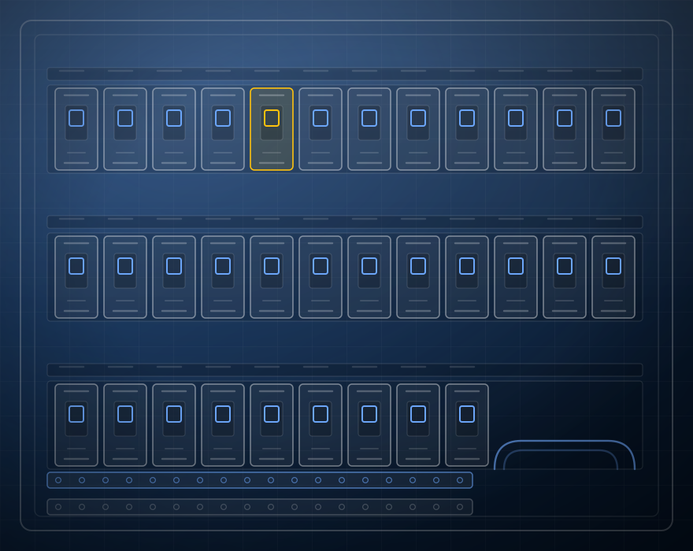

# Eletro Power 380 — site

Site institucional estático da Eletro Power 380 (engenharia elétrica, São José/SC).
Sem build, sem dependências: é só abrir o `index.html` ou publicar a pasta inteira.

```
site/
├── index.html                  página única, com todas as seções
└── assets/
    ├── css/styles.css          design system (tokens, componentes, responsivo)
    ├── js/main.js              header no scroll, menu mobile, reveal, seção ativa
    └── img/
        ├── logo-eletro-power-380.png
        ├── art-*.svg           ilustrações técnicas (ver "Fotos" abaixo)
        └── mapa-regiao-atendimento.svg
```

## Publicar

Qualquer hospedagem de arquivos estáticos serve (Hostinger, Vercel, Netlify,
GitHub Pages, S3). Suba o conteúdo de `site/` mantendo a estrutura de pastas.

Para testar localmente:

```bash
npx http-server site -p 8080
```

## Trocar as ilustrações pelas fotos reais das obras

As imagens `assets/img/art-*.svg` são **ilustrações técnicas**, não fotografias:
nenhuma foto de obra foi inventada. Elas ocupam exatamente o espaço que a foto
real vai ocupar, então a troca é de uma linha.

1. Coloque a foto em `assets/img/` (ex.: `obra-quadro-01.jpg`).
2. No `index.html`, troque o `src` e o `alt` da imagem correspondente:

```html
<!-- antes -->

<!-- depois -->

```

3. Na seção **Projetos**, quando todas as fotos forem reais, apague a linha
   `<p class="gallery-note">…</p>` (o aviso de que as imagens são representações).

Onde cada imagem aparece:

| Arquivo | Onde |
| --- | --- |
| `art-quadro-distribuicao.svg` | hero + card grande do portfólio |
| `art-infraestrutura.svg` | seção "Sobre" + card de infraestrutura |
| `art-painel-comando.svg` | card de automação |
| `art-carregador-veicular.svg` | card de mobilidade elétrica |
| `art-ar-condicionado.svg` | card de climatização |
| `art-cftv-telecom.svg` | card de tecnologia |

Proporções recomendadas: **4:3** para os cards e para a seção "Sobre", **16:11**
para o card grande do portfólio e para o hero. Exporte em JPG, largura de
1600 px e até ~300 KB por foto.

## Publicar depoimentos reais

A seção "O que nossos clientes dizem" está pronta, mas **não tem depoimento
nenhum escrito** — nada foi inventado. Quando existirem avaliações reais:

1. No `index.html`, dentro de `#depoimentos`, apague o bloco `.reviews-empty`.
2. Descomente o bloco `<div class="reviews">` logo acima e repita o
   `<article class="review">` uma vez para cada avaliação real.

## Trocar telefone, e-mail ou cidades

Tudo está escrito diretamente no `index.html`. Use "localizar e substituir":

| O quê | Como aparece |
| --- | --- |
| WhatsApp / telefone | `5548992038081` (nos links `wa.me` e `tel:`) e `(48) 99203-8081` (texto) |
| E-mail | `gabrielarthur.edf@gmail.com` |
| Instagram | `eletropower380v` |
| Cidades atendidas | seção `#regiao` e bloco "Atendemos" no rodapé |

Ao mudar o número, atualize também o `assets/img/mapa-regiao-atendimento.svg`
se as cidades mudarem, e o bloco `application/ld+json` no `<head>` (dados
estruturados que o Google lê).

## Decisões de design

- **Paleta**: azul-marinho `#081A2F`, azul tecnológico `#1F6FEB`, branco
  `#F8FAFC` e cinza `#E8EDF3`. Amarelo `#FFC20E` só como acento fino (traço do
  rótulo, detalhe das ilustrações). Verde só em elementos de WhatsApp.
- **Tipografia**: Manrope (Google Fonts) com fallback para Inter e fontes de
  sistema — a página continua legível se a CDN falhar.
- **Movimento**: apenas `opacity` e `translateY` na entrada, elevação leve no
  hover e zoom sutil nas imagens. Tudo desligado em
  `prefers-reduced-motion: reduce`.
- **Acessibilidade**: link "pular para o conteúdo", foco visível em todos os
  interativos, `aria-expanded` no menu mobile, contraste mínimo de 4.5:1 no
  texto corrido.
